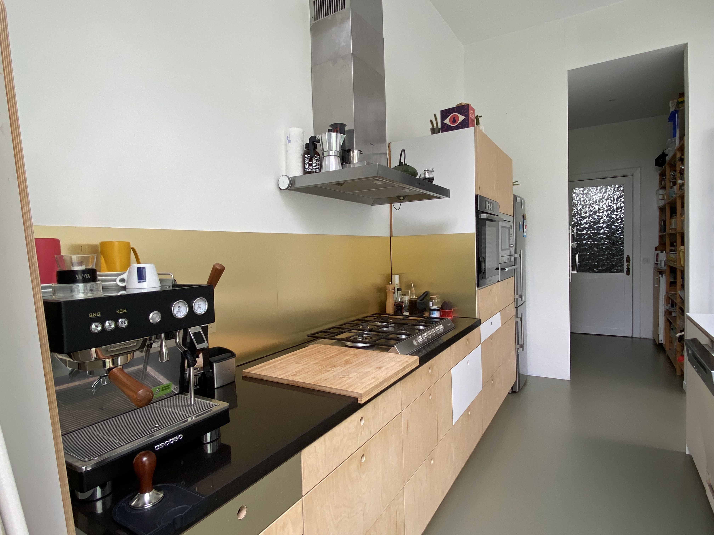
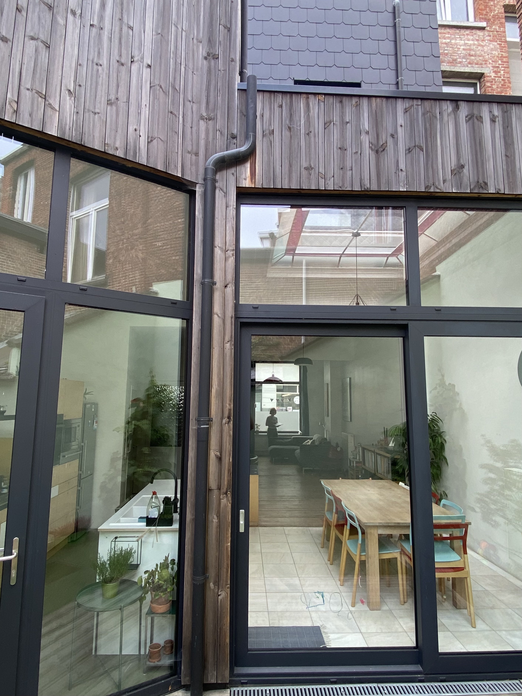

# Sergeyselsstraat 27, Borgerhout

## Ligging

Middenin het bruisende Borgerhout, vlakbij het Moorkensplein en op een boogscheut van de Dageraadplaats.

## Troeven

Hoge plafonds op alle verdiepingen, veel naruurlijke lichtinval, ruime kamers, aangename levendige buurt. 

## Indeling 

Gelijkvloers:  Eengemaakte woonruimte (living, speelruimte, eetkamer, keuken) met aansluitende berging + toilet. Ruime gang met keldertoegang.  
Eerste verdieping: Zeer ruime master bedroom, rechtstreeks verbonden met een tweede (slaap)kamer.  Badkamer toegankelijk vanuit nachthal of via 2de kamer.  
Tweede verdieping: Eengemaakte zeer ruime kamer (opnieuw opdelen mogelijk), 2de kamer onder schuin dak. Iedere kamer heeft 2 ramen.  
Helemaal onderkelderd op stahoogte.  

## Ik heb interesse

Contacteer ons vrijblijvend om eens te komen kijken:
- info@sergeyselsstraat.site
- 0486 41 25 47

## Vraagprijs

tien miljoen miljard 

## Foto's

  

|||
||||

