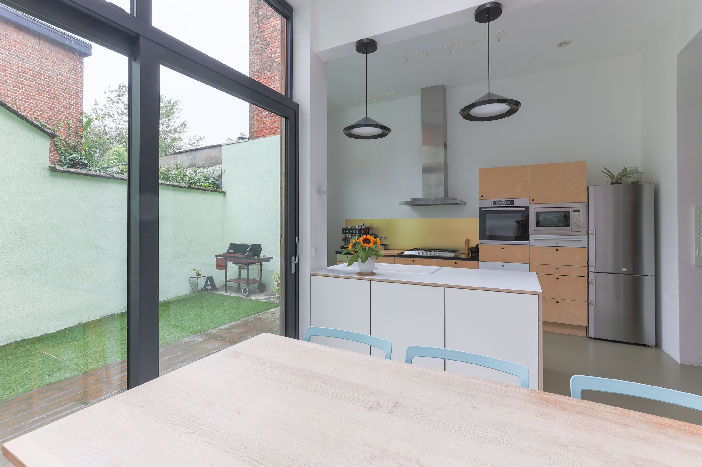
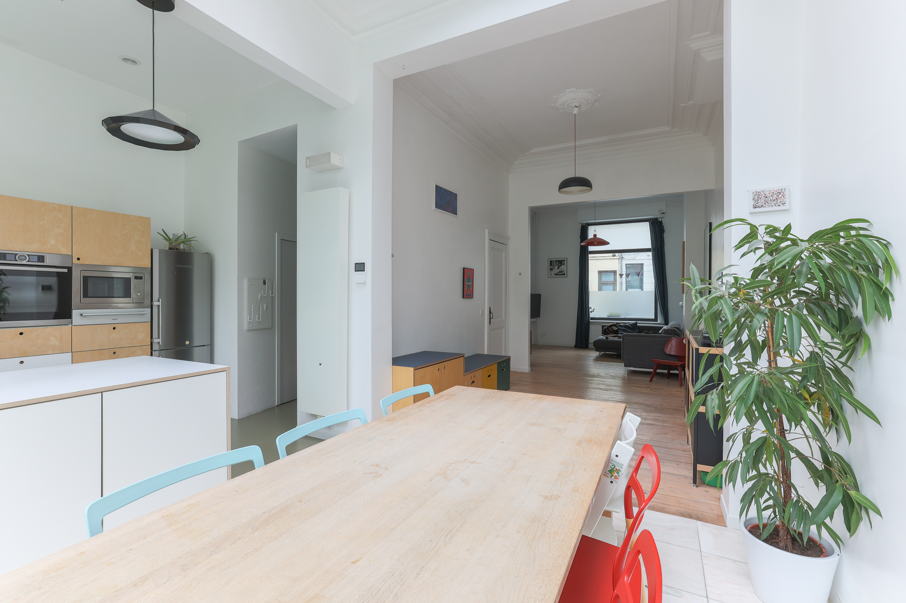
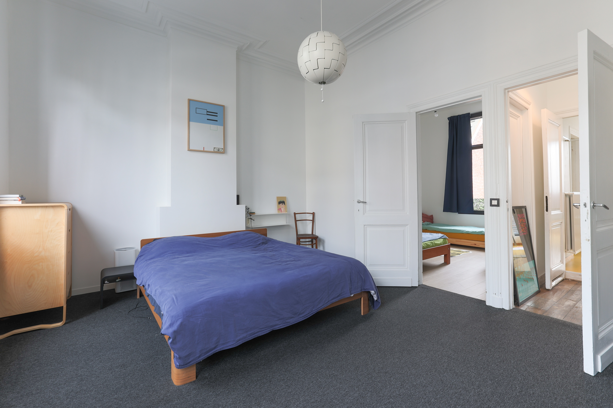
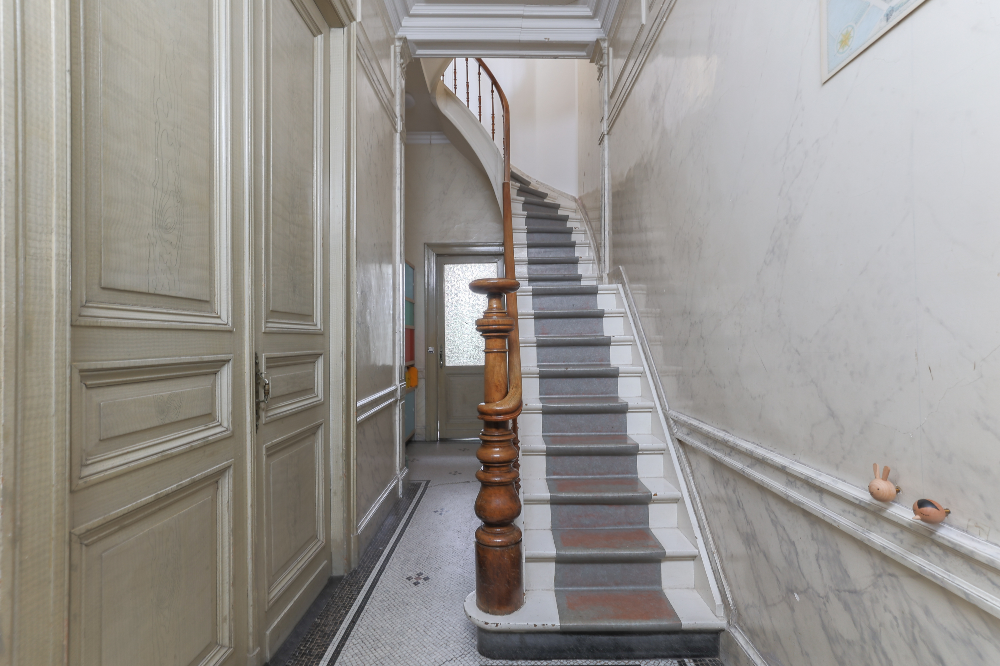

Ruime eengezinswoning met stadstuin / instapklare totaalrenovatie met hoogwaardige materialen / lichtrijke woning door de brede gevel, grote ramen en hoge plafonds op iedere verdieping / 4 tot 6 (slaap)kamers / functionele droge kelder / energiezuinig en gunstig EPC / aangename en levendige buurt nabij het Moorkensplein.

  

|||
|||

## Indeling 
#### Gelijkvloers 
- Hal met mogelijkheid om fiets te stallen, bergruimte en toegang tot kelder
- Leefruimte, eetkamer, open keuken
- Geïnstalleerde keuken met hoogwaardige toestellen (vaatwas, 5-pits gasfornuis, combi (stoom)oven, microgolf, warmhoudschuif, dampkap, koel-vriescombinatie en aansluitende bergruimte
- Toilet
- Onderkelderd op stahoogte: ca. 50 m²

#### Eerste verdieping
- Badkamer: ca. 11 m² Uitgerust met bad, dubbele douche, dubbele lavabo, toilet, aansluiting voor wasmachine, toegang tot terras om bv. droogrek te plaatsen.
- Kamer 1: ca. 24 m², rechtstreeks verbonden met de tweede kamer.
- Kamer 2: ca. 12 m²
 
#### Tweede verdieping 
- Kamer 3: ca. 19 m²
- Kamer 4: ca. 24 m². Deze kamer kan opgesplitst worden tot een 5e kamer.
  
#### Oppervlakte
- Bewoonbaar ca. 186 m²
- Buitenruimte gelijkvloers ca. 18 m², oriëntatie: oost
- Perceel ca. 90 m²

### Energie
- Condensatieketel Vaillant EcoTec Plus (2014)
- Zonnepanelen ([3,5](docs/pv_1.jpg){:target="_blank"}-[4,8](docs/pv_2.png){:target="_blank"} kWp)
- Regenwaterrecuperatie (3000L)
- Elektrische installatie conform AREI, geldig tot 2043

### Attesten
- [EPC B (148 kWh/m² jaar), opgemaakt op 31/05/2024](docs/epc.pdf){:target="_blank"}
- [Asbestvrij: attest opgemaakt op 20/06/2024](docs/asbestattest.pdf){:target="_blank"}
- [Bodemattest aanwezig, geen risicogrond](docs/bodemattest.pdf){:target="_blank"}

### Allerlei
- Aantal gevels: 2
- Gevelbreedte: 6 m
- [Mobiscore 9.7](docs/mobiscore.png){:target="_blank"}
- [K.I. 945€](docs/info_kadaster.png){:target="_blank"}
- Overstromingsgebied: NVT
- Beschikbaar: datum in overleg te bepalen

### Renovatietraject
- 2014: Afbraak & heropbouw achterbouw,sanitair,elektriciteit,ramen achtergevel…
- 2017: Ramen en deur vooraan
- 2019: Renovatie van het dak, isolatie
- 2021: Renovatie voorgevel & installatie zonnepanelen

## Richtprijs
525 000,00 euro

## Plan je bezoek
Maak een afspraak via [deze agenda](https://calendly.com/annesmits/30min?month=2024-09){:target="_blank"}  
Past dit niet? [Graag een seintje.](https://calendly.com/annesmits/30min?month=2024-09){:target="_blank"}

